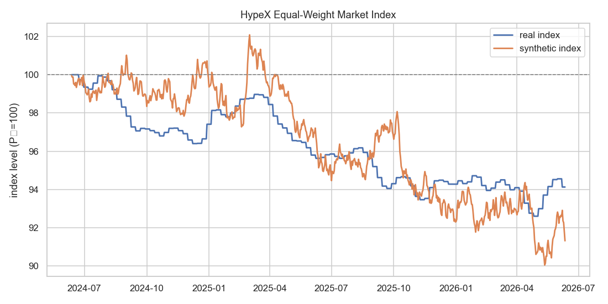
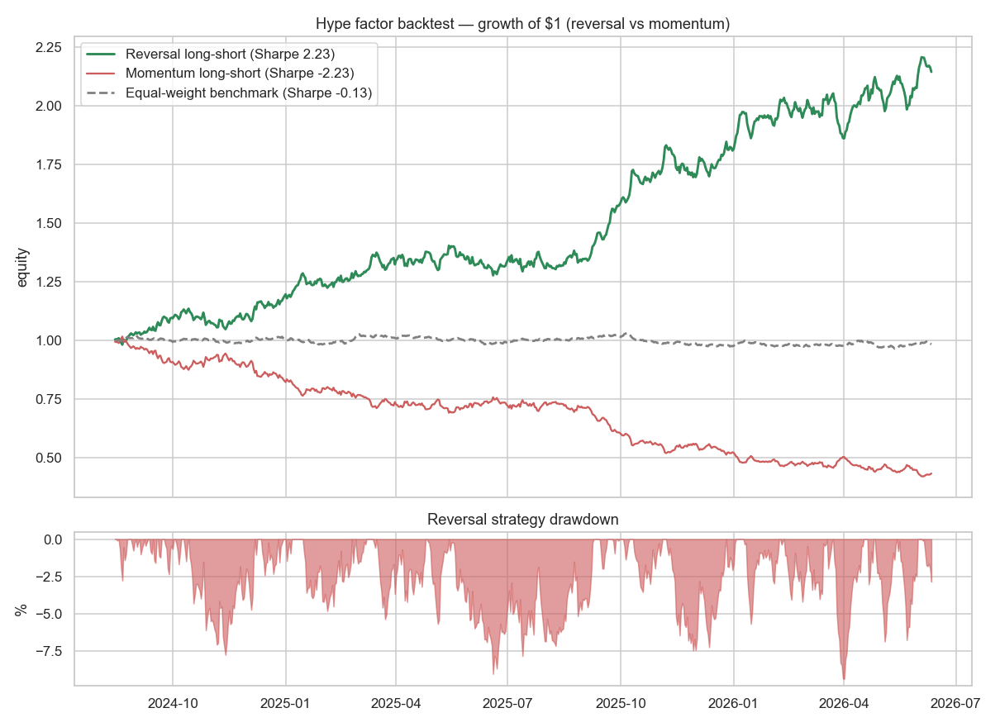
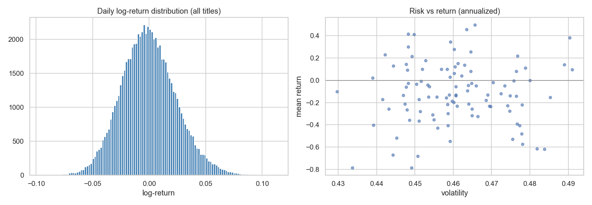
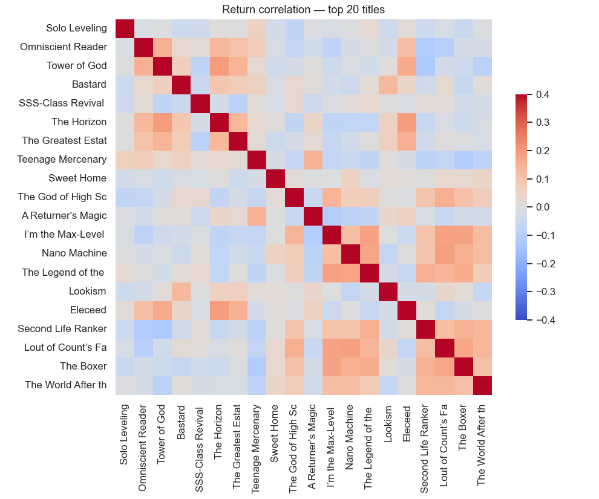

# HypeX — Comics Hype Market Analytics

**An end-to-end analytics project that treats "comic-book hype" as a financial market.**
100 Korean manhwa/webtoon titles → a daily demand signal → a price index → returns, risk,
factor backtesting, and a BI dashboard. Python · R · SQL-style modeling · PowerBI/Tableau.

> ⚠️ **The "price" is a modeled demand/popularity index (P₀ = 100), not a real market price.**
> Two data tracks: **synthetic** (a documented model, all 100 titles, 2 yrs daily) and
> **real** (actual Google Trends search interest, top 30 titles).

## Skills demonstrated
| Area | What |
|------|------|
| **Data engineering** | API ingestion (AniList GraphQL, Google Trends), entity resolution & query disambiguation, star-schema modeling, idempotent/resumable pulls with rate-limit handling |
| **Python analytics** | pandas/numpy EDA — log-returns, annualized volatility, Sharpe, drawdown, correlation, cohort analysis |
| **Quant** | cross-sectional hype-factor backtest (momentum vs reversal), strict anti-lookahead, long-short construction, turnover/drawdown |
| **R / statistics** | ARIMA forecasting (AIC grid-search), **GARCH(1,1) fit by MLE from scratch**, Engle-Granger cointegration — all base R |
| **BI / visualization** | interactive Plotly dashboard + a PowerBI/Tableau build guide with DAX measures |

## Headline results
| | |
|---|---|
|  |  |
| Equal-weight market index — synthetic vs real | Hype factor — **reversal beats momentum** |
|  |  |
| Risk vs return across 100 titles | Return correlation (≈0 mean → real dispersion) |

- The **real** (Google Trends) market index cools to ~94 over two years; the synthetic market centers on 100.
- Median annualized volatility ≈ **46%**; mean cross-title return correlation ≈ **0** (a genuinely diversified cross-section).
- **Hype mean-reverts:** a contrarian (reversal) long-short earns Sharpe **+2.2** while the momentum version loses by the same margin — a real regime read. *(Magnitudes are inflated by synthetic mechanics; the value is the methodology.)*
- R: **ARIMA(2,1,2)** index forecast; **GARCH(1,1)** with **0.92** volatility persistence; a **cointegrated pair** flagged for a pairs trade (ADF −4.46).

▶ **Interactive dashboard:** open [`dashboard/hypex_dashboard.html`](dashboard/hypex_dashboard.html) ·
**Notebooks:** [EDA](analytics/notebooks/01_eda.ipynb), [backtest](analytics/notebooks/02_backtest.ipynb) ·
**Full write-up:** [docs/CASE_STUDY.md](docs/CASE_STUDY.md)

## Pipeline
```
AniList GraphQL ─┐
                 ├─► universe (100 titles, themed/dated cohorts)
Google Trends ───┘            │
                              ▼
        demand signal ──► price model (z-score → hype index → smoothing → price)
        (synthetic + real)            │
                                      ▼
                 Python EDA + quant backtest · R stats · Plotly/PowerBI dashboard
```

## Reproduce
```bash
pip install -r analytics/requirements.txt          # pandas, plotly, seaborn, statsmodels, jupytext, pytrends
python analytics/universe/fetch_anilist.py         # 1. universe from AniList
python analytics/pipeline/generate_synthetic.py    # 2. Track 1 (synthetic, 100 titles)
python analytics/trends/build_query_map.py         # 3. Track 2 query map ...
python analytics/trends/fetch_trends.py            #    ... pull Google Trends (top 30)
python analytics/pipeline/reprice_real.py          #    ... price the real signal (weekly)
python analytics/pipeline/combine_tracks.py        # 4. unified dataset
jupytext --to notebook --execute analytics/notebooks/01_eda.py
jupytext --to notebook --execute analytics/notebooks/02_backtest.py
Rscript analytics/r/report.R                       # 5. R statistical report
python dashboard/build_dashboard.py                # 6. interactive dashboard
```

## Analytics layout
```
analytics/
  universe/   fetch_anilist.py · titles.csv · candidates.csv     # API ingestion + curation
  trends/     build_query_map.py · fetch_trends.py · query_map.csv
  pipeline/   pricing.py · generate_synthetic.py · reprice_real.py · combine_tracks.py
  notebooks/  01_eda.ipynb · 02_backtest.ipynb
  r/          report.R
  reports/    figures/*.png · *_findings.md
  data/exports/  prices_all.csv · titles_dim.csv · market_index.csv · metrics*.csv
dashboard/    build_dashboard.py · hypex_dashboard.html · POWERBI_TABLEAU_GUIDE.md
```

## The data platform underneath
The analytics sit on the original **HypeX** application — a FastAPI backend, Next.js
frontend, and PostgreSQL data platform with a plugin-based ingestion system and the same
documented price model. See [docs/ARCHITECTURE.md](docs/ARCHITECTURE.md) and
[docs/DATA_MODEL.md](docs/DATA_MODEL.md). The analytics track above is deliberately
self-contained (CSV in/out, no database required) so it reproduces anywhere.

## Honest data note
Title metadata and real search interest are real (AniList, Google Trends). Prices are a
**modeled index**, not traded values, and the synthetic track is clearly labeled as such.
`Sweet Home`'s real signal is flagged as noisy (a large Netflix adaptation inflates search).
This transparency is the point — the project demonstrates the analytics pipeline, not a
claim to predict comic popularity.
